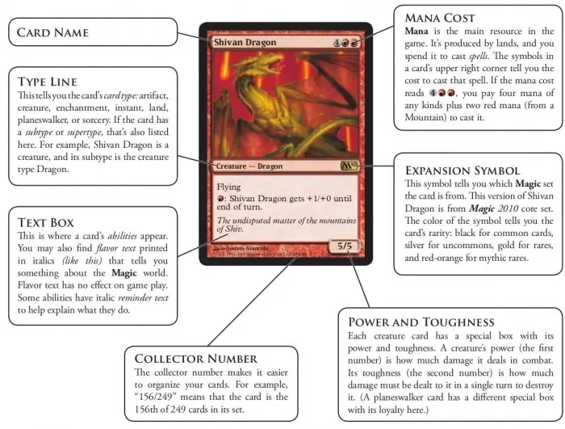
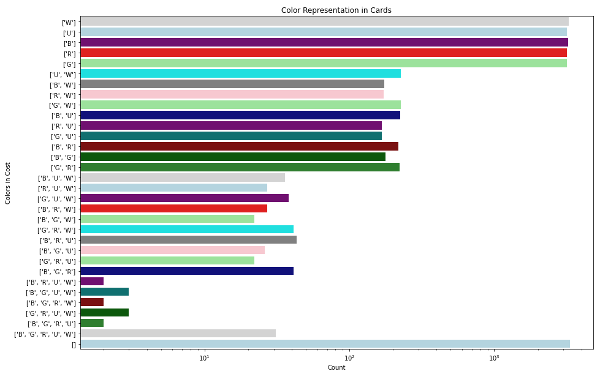
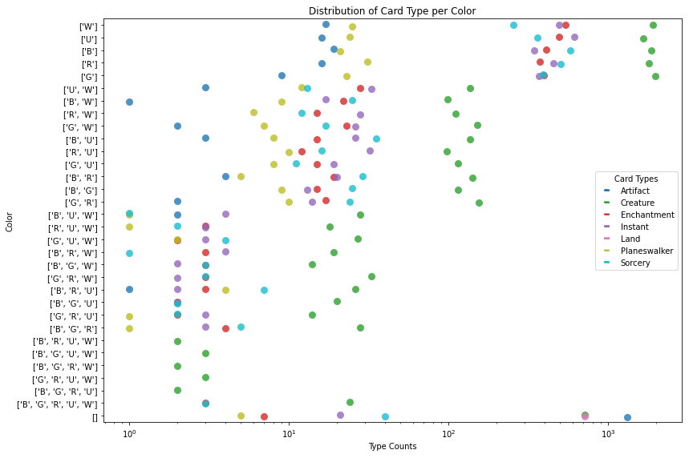
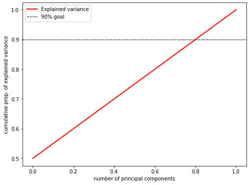
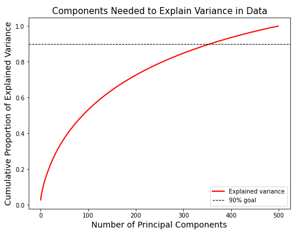
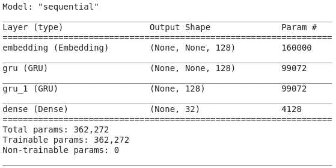
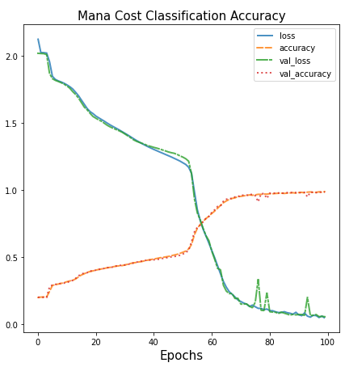

# Magic: the Classifying
## Leveraging Machine Learning to Predict Card Features

This project started with lofty goals. I initially wanted to create an autogenerator that, given the existing catalog of Magic cards, would be able to generate on demand new cards that obeyed the game's rules and design philosophy while also being syntactically and lexically accurate. After some initial brainstorming and feedback, I decided a better choice would be to make instead a classifier that received the features of a card except for its cost and label said cost, as a proof of concept that could be implemented as a step in creating new cards.

Before we dive too deep, let's cover what features we are talking about.

  
||
|:--:|
| We want to determine the total value in the top right, given the other data |

This example card has a lot of information, but can be translated as a number pretty simply. The value in the grey circle means it costs that amount of mana of arbitrary colors, and the symbols themselves indicate one color mana each. This card has a cost of {4}{R}{R}, with a total 'converted mana cost' of 6. This proved to be a simpler task, because these are strictly numerical values already, and have reasonable size.

  

Well, mostly. There are some joke sets that I elected to discard, as they are made with breaking design philosophy in mind. 

When I started, I did some exploration of the data myself to identify how the features like type and color played together, then used Non-Negative Matrix Factorization to see how well we could identify these more abstract concepts algorithmically. Returning to the idea of design philosophy card types will presumably be a bit more stratified in how they are represented per color, while each color and color combination will hopefully be about equally represented.

|
|:--:|
|
|

Wow! NMF did a great job of identifying and grouping important terms together.

