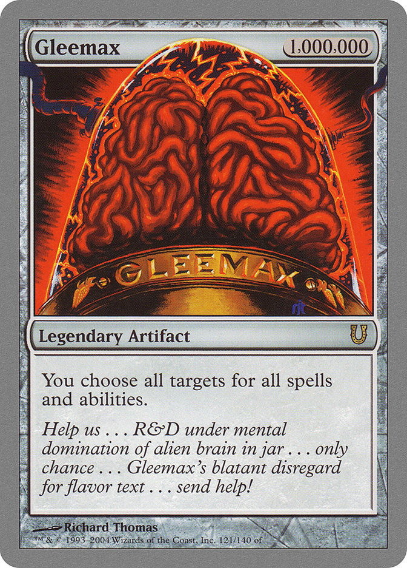

# Magic: the Classifying
## Leveraging Machine Learning to Predict Card Features

### Setting Out to Build A Generator
This project started with lofty goals. I initially wanted to create an autogenerator that, given the existing catalog of Magic cards, would be able to generate on demand new cards that obeyed the game's rules and design philosophy while also being syntactically and lexically accurate. After some initial brainstorming and feedback, I decided a better choice would be to make instead a classifier that received the features of a card except for its cost and label said cost, as a proof of concept that could be implemented as a step in creating new cards.

### A Quick Explanation of the Data

Before we dive too deep, let's cover what features we are talking about.

  
||
|:--:|
| We want to determine the total value in the top right, given the other data |

This example card has a lot of information, but can be translated as a number pretty simply. The value in the grey circle means it costs that amount of mana of arbitrary colors, and the symbols themselves indicate one color mana each. This card has a cost of {4}{R}{R}, with a total 'converted mana cost' of 6. This proved to be a simpler task, because these are strictly numerical values already, and have reasonable size.

 

  

Well, mostly. There are some joke sets that I elected to discard, as they are made with breaking design philosophy in mind. 

### Using Different Techniques to Learn Feature Importance

When I started, I did some exploration of the data myself to identify how the features like type and color played together, then used Non-Negative Matrix Factorization to see how well we could identify these more abstract concepts algorithmically. Returning to the idea of design philosophy card types will presumably be a bit more stratified in how they are represented per color, while each color and color combination will hopefully be about equally represented. 

|
|:--:|
|

After removing the 'Un-sets' I had to transform the data, first creating some uniformity in case, removing punctuation, and filtering out common language words. To do so, I used Sci-Kit Learn's Term Frequency-Inverse Document Frequency Vectorizer, then used Principal Component Analysis to identify the quantity of terms I needed to sufficiently inform the model. 

Oh, no! This is bad. This graph tells me that my PCA model needed *every single word* in a card to adequately identify it?! That seems awfully suspect. After doing some digging and even more hair-pulling, I determined that my Vectorizer had removed almost every term from my dataset, because it was given an integer parameter of 1 to remove any term that appears more than once rather than 1.0 to represent the proportion of cards it should appear in. With that fixed, I refit my PCA model.

MUCH better. Now I know that there are usually about 375 important words that my model can use to explain why a card is given its cost. After this processing, we are ready for Non-Negative Matrix Factorization. NMF is meant to identify 'latent topics,' which in this case I hope to be faithful representations of Magic's design philosophy. 

|

Wow! NMF did a great job of identifying and grouping important terms together. To give some context, Topic 2 has identified that lands add mana and, being a central part of Magic are highly represented in Core sets. Topic 4 covers zone changes by cards, while Topic 7 is an incredible job of representing Red. This is pretty exciting!

### The Pivot

At this point, I came to the gap I was unable to breach: I presently lack the knowledge to generate new objects utilizing these latent features. I pivoted to making a classifier that, utilizing my processed data, was able to label a card's cost based on its other features. To do so, I implemented a Recurrent Neural Network utilizing an Embedding layer (which handled the vectoriztion of my earlier Sci-Kit Learn object), then 2 Gated Recurrent Unit layers before eventually passing through a dense layer to filter by label.

Over the course of 100 learning iterations, the model's accuracy came away with a final accuracy of over 98% on the validation data. This is a good start to building a generator that can collate the proper features to build a new Magic card. Hopefully this project is 'To Be Continued'!
